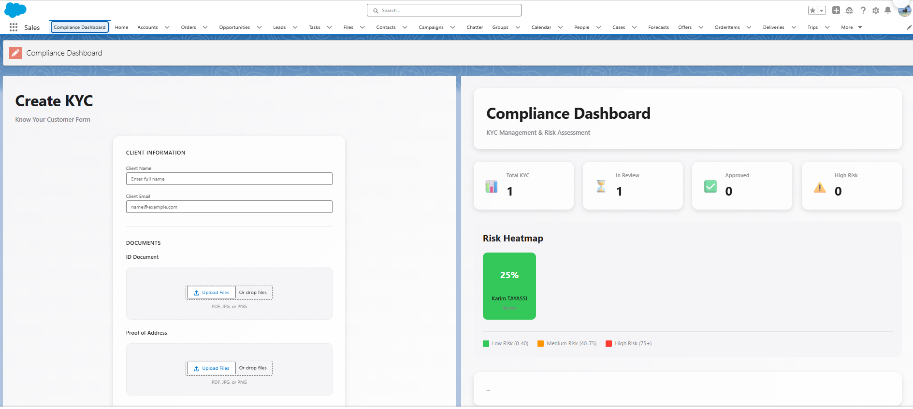
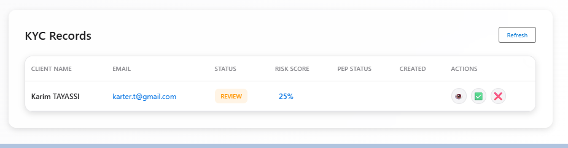
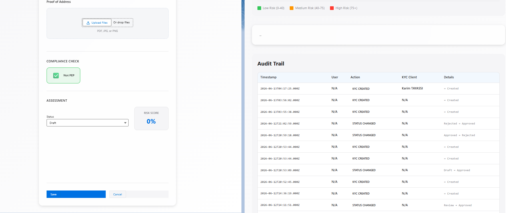

# 🏦 Compliance Dashboard - KYC & PEP Screening

**Production-ready Salesforce + MuleSoft solution for banking compliance, KYC management, and real-time PEP screening.**

---

## 📸 Overview

A comprehensive compliance management system built with Salesforce LWC and MuleSoft CloudHub. Designed for banks and financial institutions to manage KYC (Know Your Customer) workflows, screen for politically exposed persons, and maintain immutable audit trails.

**Real-time PEP detection** → **Automatic risk classification** → **Compliance approval workflow** → **Complete audit trail**

## 📸 Screenshots

### Dashboard Overview

*Compliance Dashboard with KPI cards, Risk Heatmap, and Audit Trail*

### Risk Heatmap & Audit Trail

*Color-coded risk visualization (Green/Orange/Red) with complete audit logs*

### KYC Form & PEP Screening

*Client onboarding form with real-time PEP detection and blocking*

---

## ✨ Features

### 🎯 Core Features

- **KYC Form** - Client onboarding with document upload
- **Real-time PEP Screening** - OpenSanctions API integration via MuleSoft CloudHub
- **Automatic Risk Scoring** - Color-coded risk levels (Green/Orange/Red)
- **Approval Workflow** - Compliance officer review and decision
- **Risk Heatmap** - Visual dashboard of client risks
- **Audit Trail** - Immutable logs of all actions (who/what/when)
- **Custom Datatable** - Interactive KYC records with inline actions

### 🎨 Design

- **Apple Design 2026** - Glassmorphism, smooth animations, dark mode
- **Responsive UI** - Mobile-friendly components
- **Real-time Validation** - Blocks PEP clients automatically
- **Production-Grade** - Enterprise security patterns

---

## 🏗 Architecture

┌─────────────────────────────────────────────────────┐

│         COMPLIANCE DASHBOARD (LWC)                   │

│  ├─ KYC Form                                         │

│  ├─ Approval Dashboard + Custom Datatable            │

│  ├─ Risk Heatmap (Red/Orange/Green)                  │

│  └─ Audit Log Viewer                                 │

└────────────────┬────────────────────────────────────┘

│

┌────────▼─────────┐

│    SALESFORCE    │

│  ├─ KYC__c       │

│  ├─ AuditLog__c  │

│  └─ Apex Layer   │

└────────┬─────────┘

│

┌────────▼─────────────────┐

│   MULESOFT CLOUDHUB      │

│  PEP Checker API         │

└────────┬─────────────────┘

│

┌────────▼──────────────────┐

│  OpenSanctions API        │

│  (Real-time PEP Database) │

└───────────────────────────┘

---

## 🚀 Technology Stack

| Layer | Technology |
|-------|-----------|
| **Frontend** | Lightning Web Components (LWC), CSS3 (Glassmorphism) |
| **Backend** | Apex, Salesforce Platform |
| **Integration** | MuleSoft Anypoint Studio, CloudHub |
| **APIs** | OpenSanctions, REST |
| **DevOps** | Salesforce CLI, Git/GitHub |

---

## 📊 Use Cases

### Banking Compliance
- Automated KYC checks before account opening
- Real-time PEP screening during client onboarding
- Risk categorization for regulatory requirements

### AML/CFT Workflows
- Detect politically exposed persons (FINMA compliant)
- Automatic rejection of sanctioned individuals
- Audit trail for regulatory inspections

### Risk Management
- Visual risk dashboard for compliance teams
- Approval workflows with decision tracking
- Historical logs for compliance audits

---

## ⚙️ Installation & Deployment

### Prerequisites
- Salesforce Org (Developer/Sandbox)
- Salesforce CLI
- Git
- MuleSoft CloudHub Account (optional, for CloudHub deployment)
- OpenSanctions API Key (free tier available)

### 1. Clone & Setup
```bash
git clone https://github.com/KarterKiller/compliance-dashboard.git
cd compliance-dashboard
```

### 2. Deploy to Salesforce
```bash
sf project deploy start --source-dir force-app --target-org your-org-alias
```

### 3. Configure Remote Site Setting
In Salesforce Setup:
- **Setup → Remote Site Settings → New**
- **Remote Site Name:** PEPCheckerCloudHub
- **Remote Site URL:** https://pep-checker-api-[your-instance].usa-e2.cloudhub.io

### 4. Create Custom Objects (if needed)
```bash
sf sobject create --sObject KYC__c
sf sobject create --sObject AuditLog__c
sf sobject create --sObject RiskAssessment__c
```

### 5. Deploy MuleSoft Flow (Optional)
```bash
# See mulesoft-flow/ directory for CloudHub deployment
```

---

## 📋 LWC Components

### kycForm
- Client name, email, document uploads
- Real-time PEP status checking
- Automatic risk scoring
- Status management

### approvalDashboard
- KPI cards (Total/Review/Approved/High Risk)
- Custom datatable with inline actions
- Risk heatmap visualization
- Audit log viewer

### riskHeatmap
- Color-coded risk visualization
- Grid layout with client cards
- Legend (Low/Medium/High risk)

### auditLogViewer
- Immutable action logs
- Timestamp tracking
- User attribution
- Change history (Old → New)

---

## 🔐 Security & Compliance

✅ **PEP Screening** - Real-time OpenSanctions API  
✅ **Audit Trail** - Immutable logs for regulatory compliance  
✅ **Role-Based Access** - Salesforce security model  
✅ **Secure API Calls** - Remote Site whitelisting  
✅ **Data Encryption** - Salesforce platform security  

---

## 🎯 Roadmap

- [ ] OFAC Sanctions List integration
- [ ] EU Consolidated Sanctions List
- [ ] Automated FINMA reporting
- [ ] Biometric document verification
- [ ] Machine learning risk detection
- [ ] Multi-currency AML monitoring
- [ ] FATCA/CRS compliance

---

## 📈 Performance

- **API Response Time:** ~500ms (PEP check via CloudHub)
- **Custom Datatable:** 100 records, sub-100ms rendering
- **Risk Heatmap:** 50+ clients, smooth animations
- **Audit Trail:** Real-time logging with minimal overhead

---

## 🛠 Development

### Project Structure

force-app/main/default/

├── classes/

│   └── KYCController.cls

├── lwc/

│   ├── kycForm/

│   ├── approvalDashboard/

│   ├── riskHeatmap/

│   └── auditLogViewer/

├── objects/

│   ├── KYC__c/

│   ├── AuditLog__c/

│   └── RiskAssessment__c/

└── staticresources/
mulesoft-flow/

├── pep-checker-api.xml

├── dev.properties

└── pom.xml

### Local Development
```bash
# Watch mode
sf plugins install @salesforce/cli-plugins-source-tracked-changes

# Deploy on save
sf project deploy start --source-dir force-app --target-org your-org
```

---

## 🤝 Contributing

1. Fork the repo
2. Create feature branch (`git checkout -b feature/amazing-feature`)
3. Commit changes (`git commit -m 'Add amazing feature'`)
4. Push to branch (`git push origin feature/amazing-feature`)
5. Open a Pull Request

---

## 📝 License

MIT License - See LICENSE file for details

---

## 👨‍💻 Author

**Karim TAYASSI**  
Salesforce Developer | Integration Specialist (Apex, LWC, MuleSoft, Talend)

- 🔗 LinkedIn: [@Karim TAYASSI](https://linkedin.com/in/karim-tayassi)
- 💻 GitHub: [@KarterKiller](https://github.com/KarterKiller)
- 📧 Email: karter.t@gmail.com

---

## 🎓 Certifications

- ✅ Salesforce Platform Developer I (2025)
- ✅ Salesforce AgentForce Specialist (2025)
- 🔄 MuleSoft MCD Level 1 (In progress)

---

## 📞 Support

For issues, questions, or feature requests:
- Open an issue on GitHub
- Check existing documentation
- Review Salesforce docs: https://developer.salesforce.com/
- MuleSoft docs: https://docs.mulesoft.com/

---

*Last updated: June 2026*